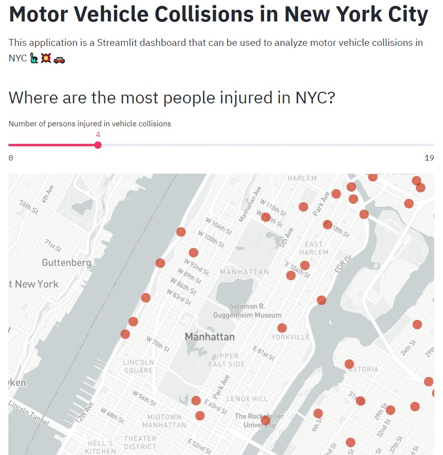
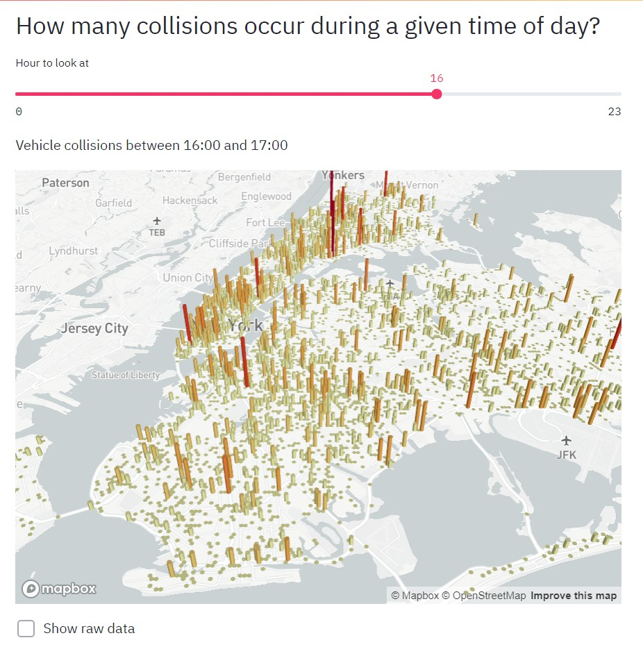
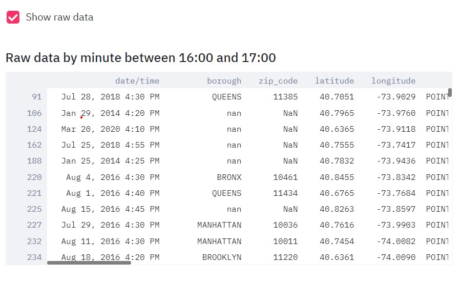
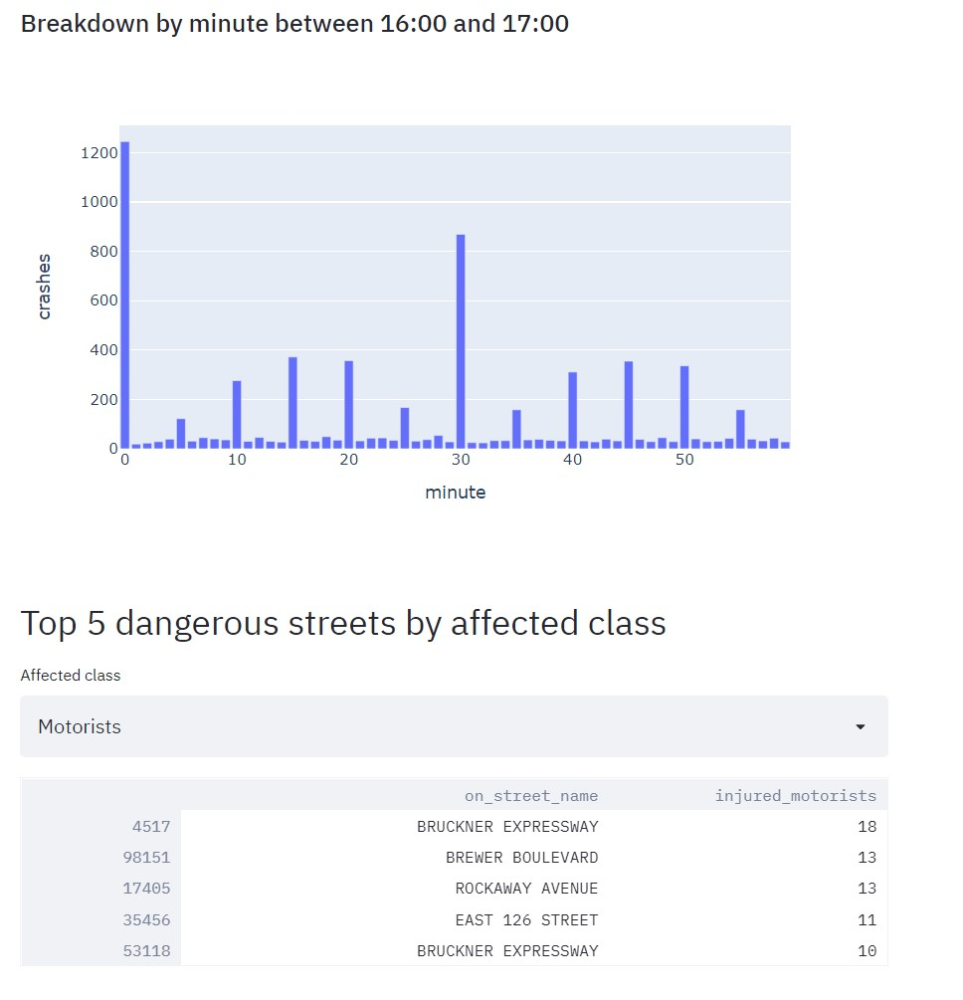

# Motor Vehicle Crashes in NYC
> This project is a web app which visualizes vehicle crashes in NYC using an interative dashboard.

## Dashboard

<p align="center">
   
   
   
   
<p />
   
## Dataset
The dataset used for this project is not included in this repository and can be obtained from the following link
> Link: https://catalog.data.gov/dataset/nypd-motor-vehicle-collisions-07420

Download the dataset and place it inside a folder called 'Data' inside the project repository.

## Installation

1. Clone the repository into a folder
```
$ git clone https://github.com/kishore-s-15/Vehicle-Crashes-NYC.git
```

2. Create a virtual environment
```
python -m venv .venv (or) python3 -m venv .venv
```

3. Activate the virtual environment

   > On Windows run
   ```
   .venv\Scripts\activate.bat
   ```
   
   > On Linux and MacOs run
   ```
   source .venv/bin/activate
   ```
   
4. Install the dependencies for the project in the virtual environment
```
pip install -r requirements.txt
```
   
5. Then run the following command
```
streamlit run main.py
```
This should start a web server running at your localhost:8501
